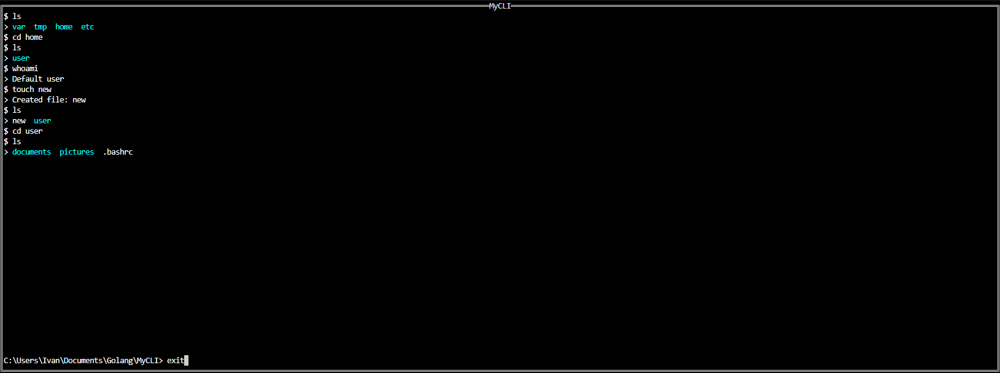

# MyCLI 🚀

Flexible and extensible command shell with virtual file system support and script execution


## 📖 About the Project

MyCLI is a modern command shell written in Go that provides powerful capabilities for working with file systems, executing scripts, and automating tasks. The project combines ease of use with configuration flexibility.

## ✨ Features

- **🖥️ Interactive Shell** - User-friendly command line interface with highlighting and autocomplete  
- **📁 Virtual File System** - Work with files and directories in an isolated environment  
- **⚡ Script Execution** - Support for executing pre-configured scripts  
- **🔧 Extensibility** - Simple architecture for adding new commands  



## 🚀 Quick Start

### Installation

```bash
# Clone repository
git clone https://github.com/Ijne/MyCLI.git
cd MyCLI

# Build project
go build -o mycli cmd/main.go

# Run
./mycli
```

### Usage

```bash
# Start interactive mode
./mycli

# Execute script
./mycli -s scripts/script1.txt
```

## 📁 Project Structure

```
MyCLI/
├── cmd/
│   └── main.go              # Application entry point
├── internal/
│   ├── VFS/
│   │   └── vfs.go           # Virtual file system
│   ├── commands/
│   │   └── commands.go      # Command implementations
│   ├── start/
│   │   ├── parse_config.go  # Configuration parsing
│   │   ├── script_execution.go # Script execution
│   │   └── start.go         # Application initialization
├── scripts/                 # Scripts directory
├── vfs/                    # Virtual file system
│   └── example.csv         # VFS example file
└── config.yaml            # Example configuration
```

## 💻 Main Commands

### File System Operations
```bash
ls                 # List directory contents
cd [path]          # Change current directory
wc                 # Word count
```

### File Management
```bash
touch [file]       # Create file
```

### System Commands
```bash        
whoami             # Current user
clear              # Clear screen
exit               # Exit application
```

## 📜 Scripts

MyCLI supports script execution from the `scripts/` directory. Scripts can contain command sequences for task automation.

## 🔧 Development

### Adding New Commands

1. Edit `internal/commands/commands.go`:
```go
func registerCustomCommands() {
    RegisterCommand("mycommand", "Command description", myCommandHandler)
}

func myCommandHandler(args []string) {
    // Command logic
    fmt.Println("My command executed!")
}
```

### Extending VFS

Modify `internal/VFS/vfs.go` to add new functionality to the virtual file system.

## 📄 License

This project is distributed under the MIT license. For more details see [LICENSE](LICENSE) file.

## 👥 Authors

- **Ijne** - [GitHub](https://github.com/Ijne)

## 🙏 Acknowledgments

- Go community for excellent language and tools  
- All project contributors  

---

**MyCLI** - make your command line work more efficient and enjoyable! 🎉
